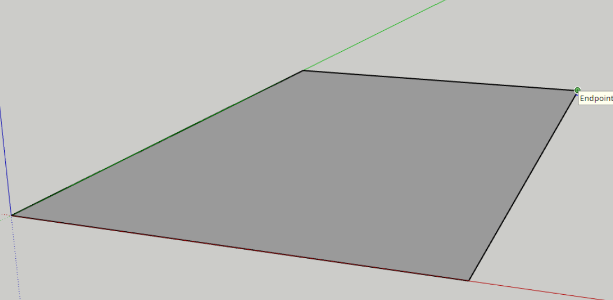
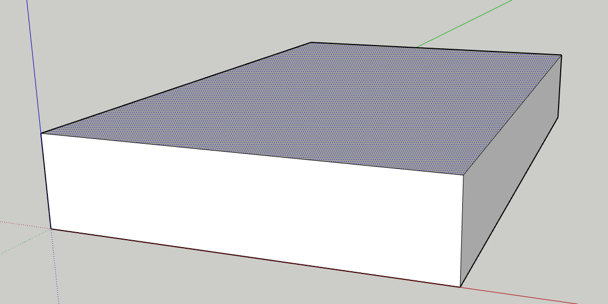

# CAD 関連
## CAD について
- [ここ](./cad.md)

## CAD の基礎
1. 面を作る
   - 四角ツールや円ツール，直線ツール等で線を引き，面を作ります。
   
2. 立体を作る
   - 押し出しツールで面に厚みをもたせ，立体にします。
   - 
3. これを繰り返し，構造物を作ります
   - [モデル](../models/models.md)みたいなのができます。

## CAD のコツ
- いきなり材を意識する必要はありません。
  - 形（階段・台・机 etc...）