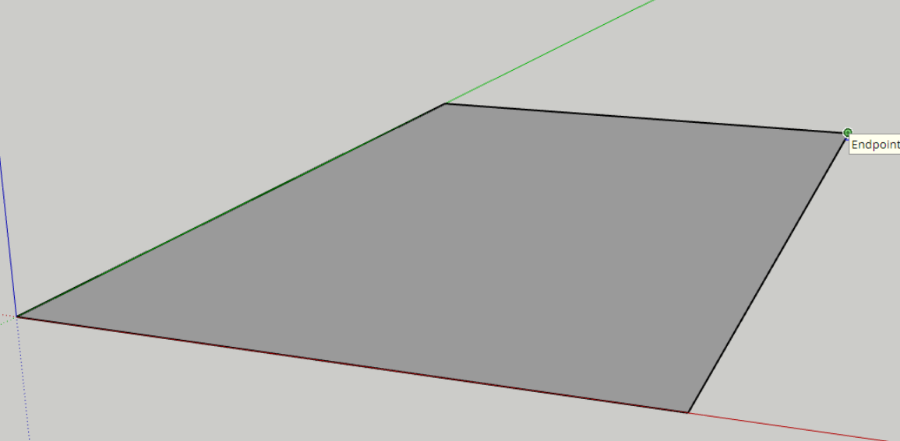
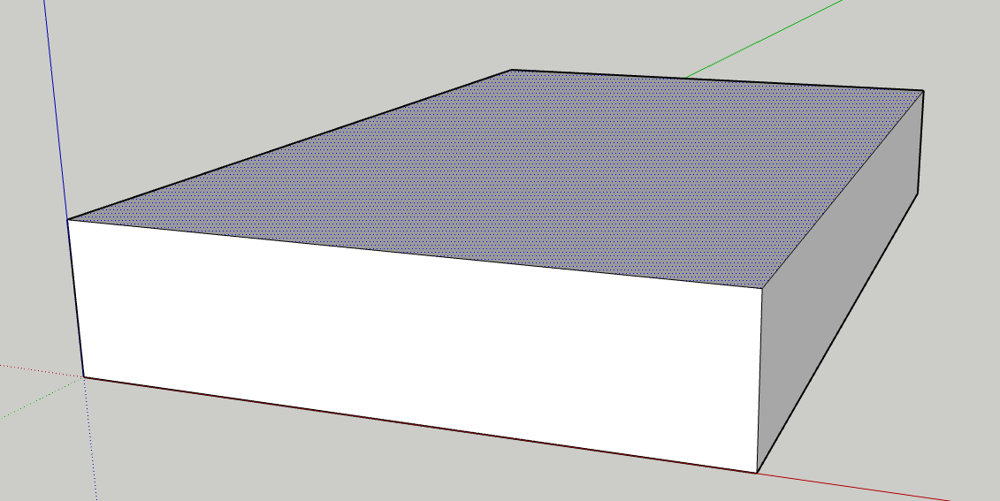

# CAD 関連

## CAD について

- [ここ](./cad.md)

## CAD の基礎

1. 面を作る

   - 四角ツールや円ツール，直線ツール等で線を引き，面を作ります。
   

1. 立体を作る

   - 押し出しツールで面に厚みをもたせ，立体にします。
   

1. これを繰り返し，構造物を作ります

   - [モデル](../models/models.md) みたいなのができます。

**これでわかるか！？って感じだと思うので，何かいい書き方を考えます...。**

## CAD のコツ

- いきなり材を意識する必要はありません。

  - 形（階段・台・机 etc...）
