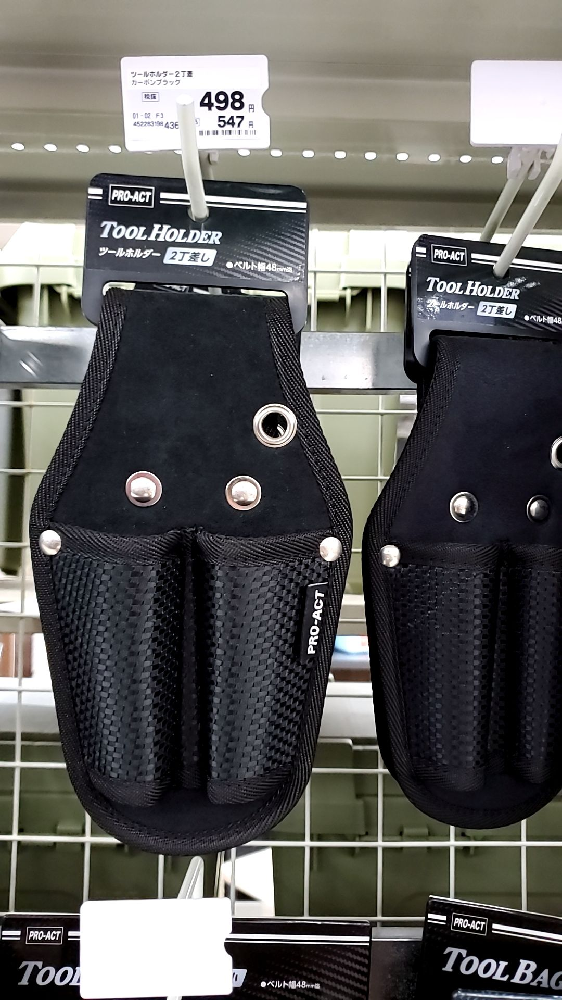
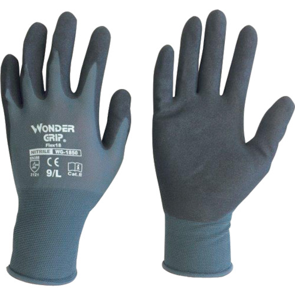
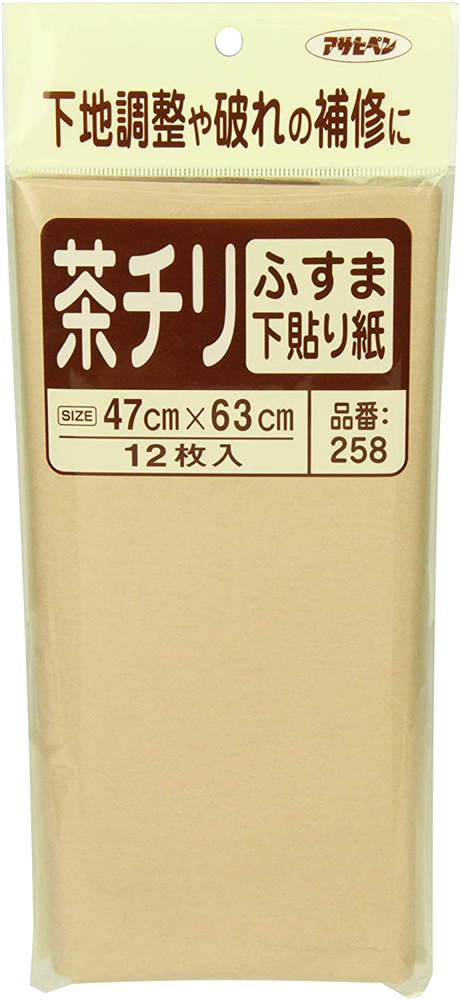
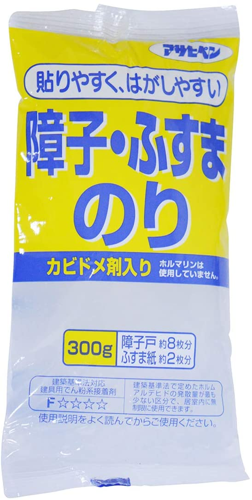
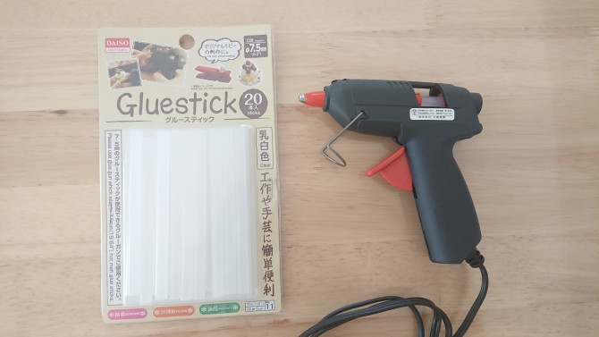
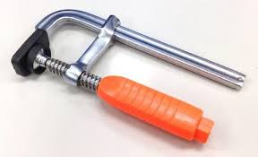
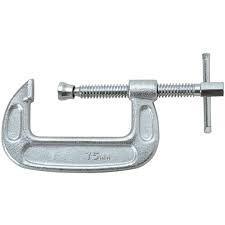

# その他

## 心がけること

- 接着剤の用途は確認しましょう
  - 接着剤は，ものによって「適した素材」「使用方法」が大きく異なります
  - 素材や要求強度によって適切に選択しましょう
- 接着剤の口（ノズル）で塗り広げるのはやめましょう
  - ノズルが詰まる原因になります
  - へら（なければ，ダンボールやベニヤ）で塗り広げるのが正しいです
  - 塗り広げる必要のない場合もあります（点状塗布・ダンゴ貼り）
  - [参考サイト](https://www.monotaro.com/s/pages/productinfo/setchakuzai_howtouse/)

## 便利だったもの・便利そうなもの（役に立った時）

### コーナン PRO-ACT「ツールホルダー2丁差」（ダンシング・ヒロイン）

- 簡易的に銃のホルスターになる
- 2丁差の間の縫い目を壊すといい感じ
- お値段も手ごろ（547円）
  
     

### マスキングテープ（ダンシング・ヒロイン）

- 神
- なんにでも使えます
- テープーコーナーに加え，建築資材コーナーにも置いてある（場合がある）ので，確認しておきましょう

### 作業手袋（全般）

- 運搬時に手を保護してくれます
- 単管の運搬等は手が滑りやすいですし，あるといいです
- ホームセンターで300円～ で買えます
- **電動工具使用時には外しましょう，巻き込み事故の恐れがあります**
- **パネル運搬時には，面に触れないようにしましょう，汚れなどが移る場合があります**
  
    

### ヘッドライト（全般）

- 夕方～夜，箱の暗所での作業に手で照らすのは大変です

### ふすま紙とのり（スロウハイツ）

- [ふすま紙](https://www.amazon.co.jp/dp/B00EXXJ6G4/ref=cm_sw_em_r_mt_dp_KP94BASN0S3294VMQ1C2)
- [のり](https://www.amazon.co.jp/dp/B0089J7520/ref=cm_sw_em_r_mt_dp_9F0V3R6HDD63E05J1F7E)
- ベニヤ板の下地に使うと便利（のりは使ったかわからないけど，一応）
- 新聞より破れにくいので，作業効率めっちゃ上がります
- ただ，お値段はします...。
  
    

### グルーガン（個人・SLY DOGS・衣装関係）

- 樹脂を低温で溶かして固めるやつです
- なんでも素早くくっつくので，ちょっとした接着に便利です
  - 動きの少ない小道具
  - 固定のテスト
  - 等
- すぐ剥がれるので，強度が必要な個所は強力な接着剤を使いましょう

    

### クランプ（個人・スロウハイツ）

- 万力・クランプなど
- 接着箇所を固定するのなどに使えます
- 個人的に大好きな工具ですが，ジゲキはあまり接着をしないので，出番は少ないかと思います
- 安価なものもある（ダイソー）ので，あって損はない（はず）
  - 一応，スロウハイツでパネルの浮きをボンドで抑えるのに使用
- おすすめは左のタイプ（幅を調整しやすい）
  
    )

